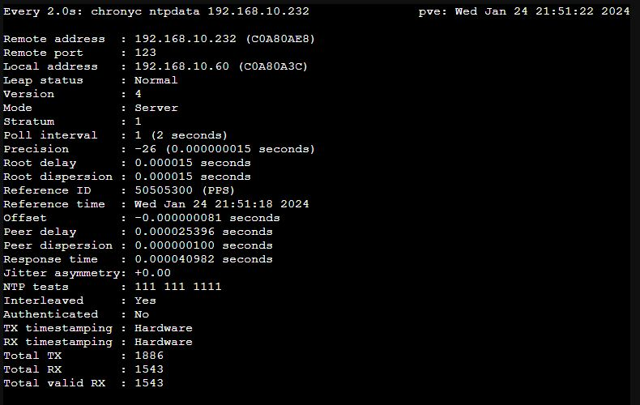

# Raspberry Pi 5B NTP Server - Stratum 1 (with Uputronics GPS HAT)
A straightforward and optimized approach to achieve a cost-effective (€200) Stratum 1 NTP server, disciplined with highly precise PPS (Pulse Per Second) sourced from the GNSS radio service plus NTP public servers across the internet to get the absolute time reference.

Can be prepared to be used with *off-the-grid* applications such as IoT in remote locations/air-gapped systems or WAN connected IoT ones (as presented here).

The end result with a Raspberry Pi 5B and an Uputronics GPS/RTC HAT Ublox M8 engine vs 6.4:

This is my recipe for Raspberry Pi OS lite `Bookworm`, kernel 6.1.72-v8-16k+.

# Index

- [Achievements](./README.md#achievements--january-2024)
- [List of materials and tools needed](./README.md#list-of-materials-and-tools-needed)
- [Step-by-step tutorial](./README.md#step-by-step-tutorial.md)
- [Acknowledgments](./README.md#acknowledgments)
- [References](./README.md#references)

## Achievements @ January 2024:
- [X] precision of 2^-26 (~15 ns).
- [X] ns local clock timekeeping (std dev < 200 ns on PPS source).
- [X] ns timekeeping across multiple networks (RMS offset < 40 ns).
- [X] stable operation with ultra low frequency value (usually ~ 450 ppb).
- [X] correct the timekeeping skew from CPU temperature flutuation.
- [X] serve time to more than 160 clients (capable of many more).
- [X] optimize the Ublox M8 chip for better timming accuracy.
- [X] set the serial baudrate to its maximum (up to 115200 bps).
- [X] provide hardware timestamping for NTP and PTP packets on the Rpi 5B.
- [X] provide PTP Hardware Clock (PHC) support under Chrony.
- [X] disable the internal hardware RTC DA9091 on the Rpi 5B.
- [X] add full support for the high precision RTC RV3028, including a new overlay to avoid the `dmesg` error "Voltage low, data is invalid".
- [X] disable GLONASS GNSS usage #slavaukraini

Chrony vs 4.5 `server` tracking statistics after 1 day of uptime:

Chrony vs 4.0 `client` tracking statistics after 1 day of uptime:

Chrony vs 4.0 `client` tracking ntpdata of this server, after 1 day of uptime:

## Checklist aiming a low latency and jitter environment @ January 2024:
- [X] Research system hardware topology, using lscpu 
- [X] Determine which CPU sockets and I/O slots are directly connected.
- [X] Follow hardware manufacturer`s guidelines for low latency hardware tuning.
- [X] Ensure that adapter cards are installed in the most performant I/O.
- [X] Ensure that CPU/memory/storage is installed and operating at its **nominal** supported frequency.
- [X] Make sure the OS is fully updated.
- [X] Enable network-latency tuned overlay settings.
- [X] Verify that power management settings are correct and properly setup.
- [X] Stop all unnecessary services/processes.
- [ ] Unload unnecessary kernel modules *(to be assessed)*
- [X] Apply low-latency kernel command line setup(s).
- [X] Perform baseline latency tests.
- [X] Iterate, making isolated tuning changes, testing between each change.

# List of materials and tools needed

**Mandatory**:
- 40 pin header 10mm spacer (if using the genuine active cooler)
- SD Card with 8GB or more
- USB SD Card reader or other similar device to install Raspberry Pi OS on the SD Card.
- Raspberry Pi 5B, with a suitable power adaptor
- Uputronics GPS HAT
- RJ45 Ethernet CAT5 (or better) cable with proper lenght

**Optional** :
- 3D printed case for housing the fully assembled server **(RPi 5B)**:
  > I suggest this [custom made case](./files/Rpi%205b%20case%20all%20v3.3mf).
  
  > PLA or PETG are generally appropriate, depending on the ambient temperature and environment you`ll apply this server in.
- Outdoor GPS active antenna with 28dB Gain, inline powered at 3-5V DC, with 5 meters of cable lenght and SMA male connector

# Step-by-step tutorial
For this tutorial, you have 3 major steps. Being the last 2 of them optional, but highly recommended, as achieves huge and superior accuracy and precision.

1. [Setup the server](./steps/setup_the_server.md)
2. [Advanced Ublox M8 tuning](./steps/advanced_ublox_m8_tuning.md)
3. [Advanced system tuning](./steps/advanced_system_tuning.md)

# Acknowledgments

1. Conor Robinson, for his cooperation and shared knowledge
2. Anthony Stirk, for his openess to help and cooperate on a further hardware improvement *(stay tuned!)*

# References
- https://conorrobinson.ie/raspberry-pi-ntp-server-part-6/
- https://github.com/raspberrypi/linux/pull/5884 *(RV3028 `backup-switchover-mode` value definitions)*
- https://store.uputronics.com/files/Uputronics%20Raspberry%20Pi%20GPS%20RTC%20Board%20Datasheet.pdf
- https://store.uputronics.com/files/UBX-13003221.pdf *or* https://content.u-blox.com/sites/default/files/products/documents/u-blox8-M8_ReceiverDescrProtSpec_UBX-13003221.pdf
- https://wiki.polaire.nl/doku.php?id=dragino_lora_gps_hat_ntp
- http://www.philrandal.co.uk/blog/archives/2019/04/entry_213.html
- https://chrony.tuxfamily.org/doc/4.2/chrony.conf.html#tempcomp
- https://hallard.me/enable-serial-port-on-raspberry-pi/
- https://gpsd.gitlab.io/gpsd/gpsd-time-service-howto.html#_arp_is_the_sound_of_your_server_choking
- https://dimon.ca/how-to-build-own-stratum-1-ntp-server/#h.1kdm8ehjrplc
- https://psychogun.github.io/docs/linux/Stratum-1-NTP-Server-using-Raspberry-Pi/
- https://chrony.tuxfamily.org/faq.html#_how_can_i_improve_the_accuracy_of_the_system_clock_with_ntp_sources
- https://tf.nist.gov/general/pdf/2871.pdf
- https://chrony-project.org/comparison.html *(good reference on why I choose chrony over ntpd)*
- https://dotat.at/@/2023-05-26-whence-time.html *(time chain of service)*
- https://forums.raspberrypi.com/viewtopic.php?p=2171999&hilit=serial+gpio+14#p2172274 *(undocumented hardware UART command for Rpi 5B)*
- https://www.dzombak.com/blog/2023/12/Mitigating-hardware-firmware-driver-instability-on-the-Raspberry-Pi.html
- https://www.dzombak.com/blog/2023/12/Disable-or-remove-unneeded-services-and-software-to-help-keep-your-Raspberry-Pi-online.html
- https://www.dzombak.com/blog/2023/12/Stop-using-the-Raspberry-Pi-s-SD-card-for-swap.html
- https://access.redhat.com/sites/default/files/attachments/201501-perf-brief-low-latency-tuning-rhel7-v2.1.pdf *(impressive guide aiming low latency on linux OS)*
- https://blog.dan.drown.org/nic-interrupt-coalesce-impact-on-ntp/
- https://quantum5.ca/2023/01/26/microsecond-accurate-time-synchronization-lan-with-ptp/
