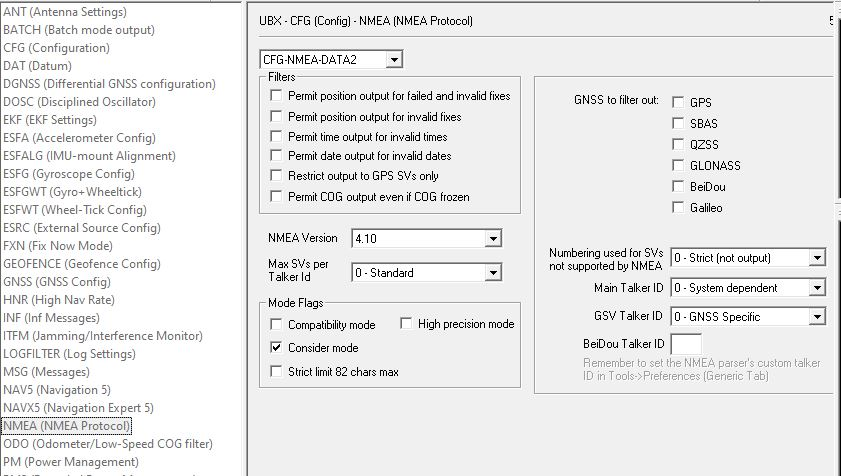
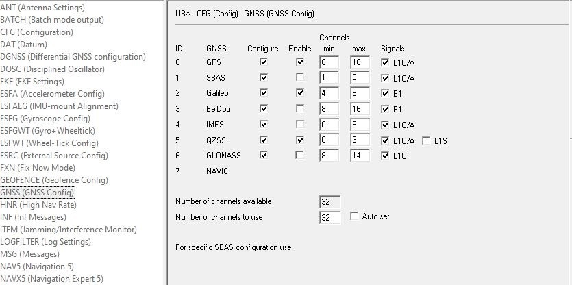
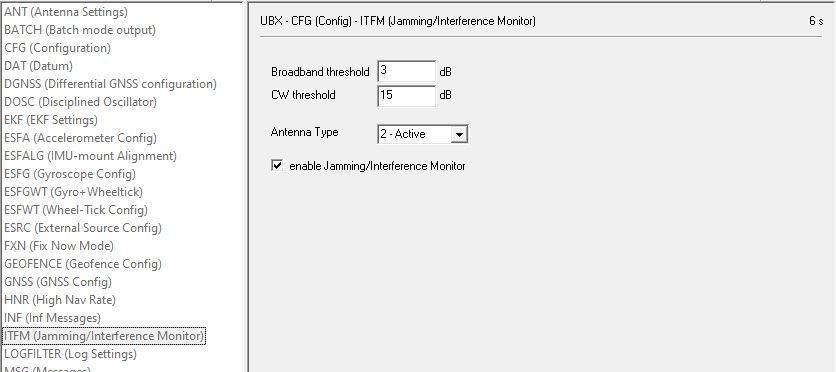
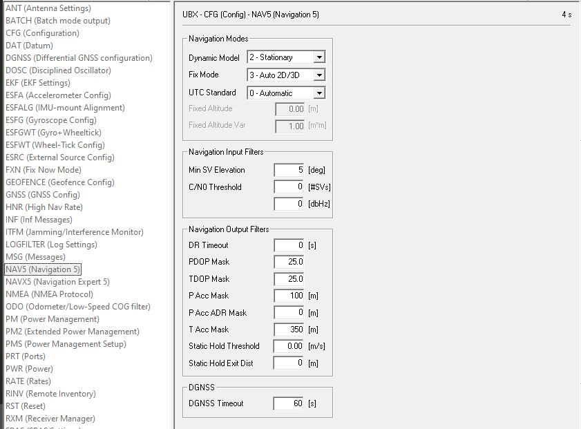
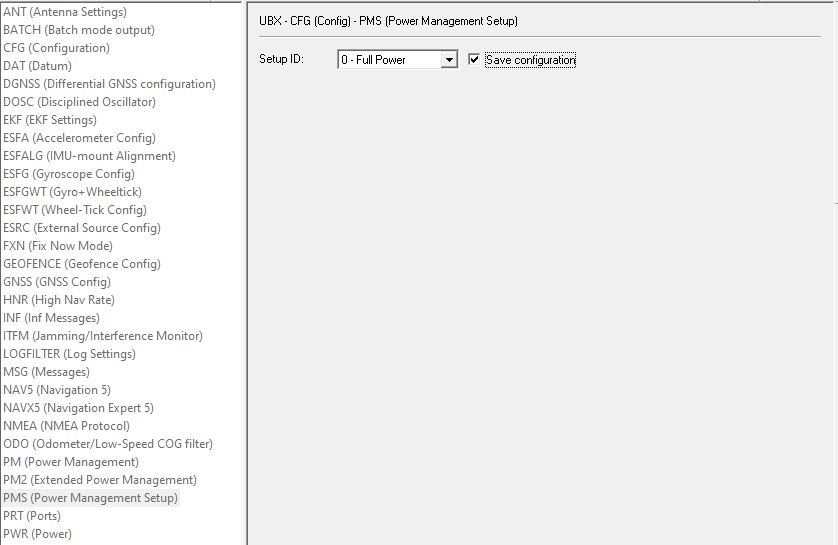
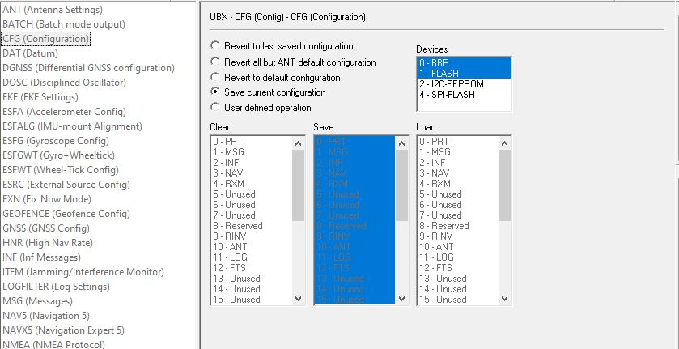

# Advanced Ublox M8 chip tuning

> [!WARNING] 
> This is optional! Proceed with caution and at your own risk!

The procedure to do it locally, on the Rpi 5B, using `ubxtool` from the `gpsd` package, needs some preparation:

> ubxtool -p MON-VER --device /dev/ttyAMA0

If shows this: `WARNING:  protVer is 10.00, should be 18.00.  Hint: use option "-P 18.00"`

Execute this (as recommended above):

> export UBXOPTS="-P 18"

Alternatively, using U-Center vs 23.08 or better, open the communication through an USB-C cable with the GPS HAT, on a Windows PC. Open the Configuration Console (CTRL+F9) and edit accordingly.

## NMEA - Enable support for GALILEO GNSS.

Change the `NMEA Version` to "4.10". This should ativate NMEA support for the GALILEO messages.

## GNSSs

Enable the GNSSs of your choise. Here, for Europe, I'm using `GPS`, `GALILEO` (no longer `GLONASS` and the SBAS `EGNOS`):

Or:
> ubxtool -e GALILEO --device /dev/ttyAMA0
>
> ubxtool -e GLONASS --device /dev/ttyAMA0
>
> ubxtool -d SBAS --device /dev/ttyAMA0
>
> ubxtool -p CFG-GNSS --device /dev/ttyAMA0

## ITFM (Jamming/Interferance Monitor)

Click on `enable Jamming/Interferance Monitor` to enable it and change `Antenna Type` to "2 - Active" (if applicable).

## NAV5 - Stationaty Dynamic Model

Change `Dynamic Model` to "2 - Stationary", to improve the timming accuracy on the device.

Or:

> ubxtool -p MODEL,2 --device /dev/ttyAMA0
>
> ubxtool -p CFG-NAV5 --device /dev/ttyAMA0

## PMS - Power Management Setup

Change `Setup ID` to "0 - Full Power" to allow a small gain on better timming accuracy.

Or:

> ubxtool -p CFG-PMS,0 --device /dev/ttyAMA0
>
> ubxtool -p CFG-PMS --device /dev/ttyAMA0

## TP5 - Time Pulse refinement

Change `Cable Delay` value to the one fitting your setup. For example, with the uBlox ANN-MB Active GPS Patch Antenna and 5 meters of RG-174 cable, the expected value should be "25" nanoseconds.

## Saving settings to EEPROM

Click on `Send`, at the lower left corner.

Or: 
> ubxtool -p SAVE --device /dev/ttyAMA0

If no errors were shown, **do not forget** to force a cold boot immediately as recommended by Ublox:

> ubxtool -p COLDBOOT --device /dev/ttyAMA0

> [!NOTE]
> There it could be up to 12.5 minutes before time pulse is available again.
